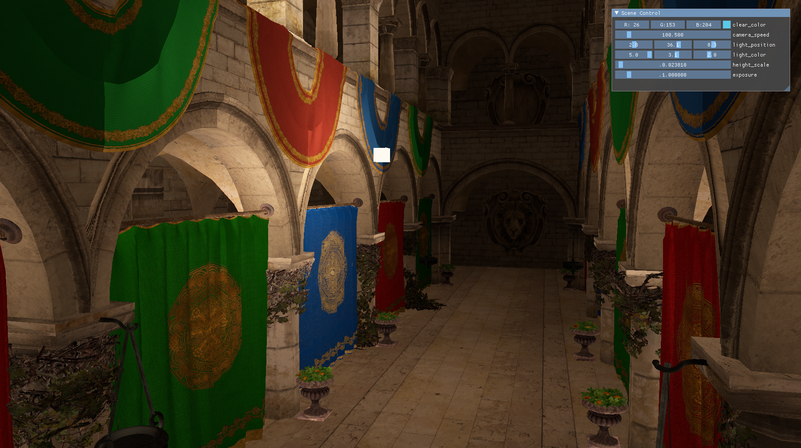
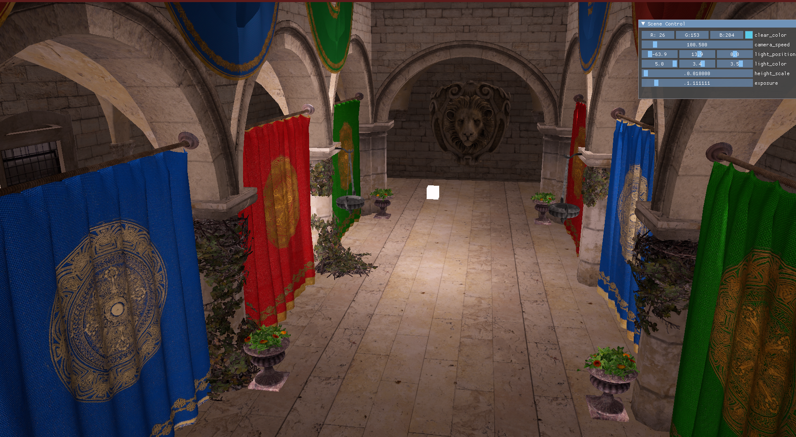
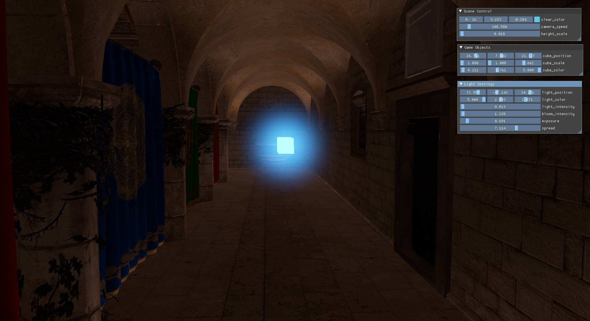

# GLEngine

Graphics renderer for quickly testing out various graphics techniques.

# Features (so far)

* Basic Phong shading.
* Model loading (using Assimp).
* Normal mapping.
* Parallax mapping.
* HDR.

# Future plans

* Bloom.
* PBR.
* Shadow mapping.
* Volumetric lighting.

# Building

Uses VCPKG as a package manager. Dependencies used are : 
* GLFW (Windowing + Input)
* Glad (Load OpenGL functions)
* GLM (Math)
* IMGUI (UI)
* Assimp (Model loading)
* STB Image (loading textures)

# Samples

